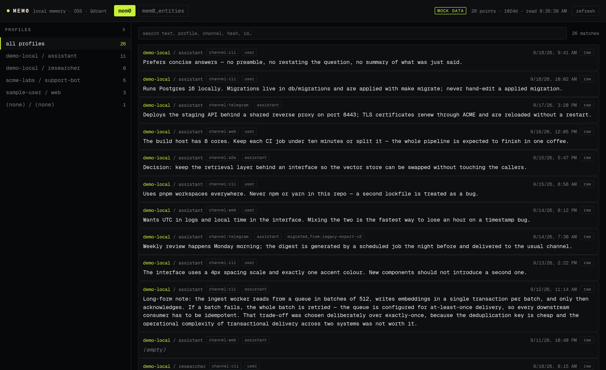

# mem0 viewer

Read and search a **mem0 OSS** memory store held in Qdrant, from the browser —
no backend, no telemetry, no dashboard to deploy.

mem0 in OSS mode ships no UI. Memories are just points in Qdrant, scoped by
`user_id` / `agent_id`, so the only way to see what your agent remembers is to
query the store by hand. This is the missing read-only view: profiles down the
side, memories in the middle, search across all of it.



## Quick start

```bash
pnpm install
pnpm dev          # http://localhost:5173
```

It reads `http://127.0.0.1:6333` by default. Point it elsewhere with:

```bash
VITE_QDRANT_URL=http://127.0.0.1:7000 pnpm dev
```

Read the security section below before using a non-localhost URL.

### No Qdrant handy?

The app ships a synthetic store so you can see it work with nothing installed:

```bash
VITE_MOCK=1 pnpm dev
```

Or append `?mock=1` to any URL. The header shows a **mock data** badge while it
is on, and real reads are skipped entirely — mock and live data are never mixed.
Nothing in the mock is real: the profiles and memories are invented.

## What it does

- **Profiles** — one row per `user_id` / `agent_id` pair with its point count,
  since a shared Qdrant instance is the only tenancy boundary mem0 OSS has.
- **Search** — case-insensitive, over the memory text plus `user_id`,
  `agent_id`, `channel`, `hash` and the point id. Matches are highlighted.
- **Collections** — switch between `mem0` and `mem0_entities`.
- **Raw payload** — expand any memory to see the stored point verbatim, and copy
  it as JSON.
- **Shareable views** — the collection, profile and search term live in the URL,
  so a filtered view can be linked or reloaded.

## How it works

There is **no backend**. The browser talks to Qdrant's HTTP API directly, and it
only ever reads:

- `POST /collections/<collection>/points/scroll` — paginates on
  `next_page_offset`, 512 points per request.
- `GET /collections/<collection>` — the collection's own point count and vector
  size.

Filtering and search are **client-side** over the loaded points. There is no
index to go stale, no query syntax to learn, and a keystroke never costs a
round-trip. Vectors are never fetched (`with_vector: false`) — this is a text
browser, so the payload is the whole story.

The whole app is one static bundle with no runtime dependencies beyond Qdrant
itself.

## Security — read this before you point it anywhere

**This app has no authentication, and it cannot have any.** Anything that can
reach the page can read every memory in the store. There is no login, no scope,
no server that could enforce one. Treat it as a local developer tool, which is
what it is.

Memory stores are unusually sensitive — they accumulate whatever an agent was
told, including things nobody meant to write down.

### The localhost problem

The default `http://127.0.0.1:6333` looks safe, and is the right default, but it
is worth understanding what it does and does not protect against.

Qdrant reflects the request `Origin` in `access-control-allow-origin` — for *any*
origin. That is the behaviour that makes this app's no-backend design possible,
and it is also a hole: a page on `https://anything.example` that you visit while
your store is running can read your entire memory store, because the browser is
told the cross-origin read is allowed. Localhost is not a boundary against that.

This was verified against Qdrant 1.19.0, not assumed:

```
$ curl -D- -o /dev/null -H 'Origin: https://evil.example.com' \
    http://127.0.0.1:6333/collections
HTTP/1.1 200 OK
access-control-allow-origin: https://evil.example.com
```

What currently limits the blast radius is **Private Network Access**, the browser
feature that gates requests from a public site to a private address. Chromium
enforces it; Firefox and Safari do not implement it. So the honest summary:

- Your store is reachable from any web page you visit, in browsers without PNA.
- Do not run this, or Qdrant, on a machine where you browse the open web and
  care about what is in the store — or accept that it is readable.

### What actually helps

1. **Set an API key on Qdrant and give it to the viewer.** This is the effective
   fix, and it is the reason the viewer supports a key:
   ```bash
   VITE_QDRANT_API_KEY=your-key pnpm dev
   ```
   Verified: a keyed Qdrant answers `401` without the key and `200` with it, and
   its CORS preflight allows the `api-key` header. A page that does not know the
   key cannot read the store. The caveat is that the key is baked into the bundle
   at build time, so anyone who can load the page can read it — this raises the
   bar against drive-by pages, and is not a substitute for not publishing the app.

2. **Keep Qdrant on loopback.** Do not bind it to `0.0.0.0` on a network you do
   not control. Anyone who can reach the port can read the store.

3. **If you need remote access**, put something that authenticates in front of it
   — a reverse proxy with auth, an SSH tunnel, or a VPN — rather than exposing
   either port.

Note that Qdrant has no CORS origin *allowlist* to set. Its only CORS setting is
`service.enable_cors` (a boolean, on by default), so "restrict the origins" is
not an available mitigation — confirmed against 1.19.0 by setting
`service.cors.origins` and observing that a disallowed origin was still
reflected. The API key is the lever that exists.

### What this app does not do

It only reads. It issues `scroll` and `GET /collections/*` and nothing else — no
upserts, no deletes, no collection management. It never sends your memories
anywhere except to the Qdrant you configured, and it makes no third-party
requests at all (the font is bundled).

## Configuration

| What | Default | How to change |
|---|---|---|
| Qdrant URL | `http://127.0.0.1:6333` | `VITE_QDRANT_URL=… pnpm dev` |
| Qdrant API key | none | `VITE_QDRANT_API_KEY=… pnpm dev` |
| Collections | `mem0`, `mem0_entities` | `COLLECTIONS` in `src/qdrant.ts` |
| Mock store | off | `VITE_MOCK=1`, or `?mock=1` |
| Dev port | `5173` | `vite.config.ts` |

Both env vars are baked in at build time, so set them when you build, not only
when you run.

## Commands

```bash
pnpm dev         # dev server
pnpm build       # typecheck + static bundle in dist/
pnpm preview     # serve the built bundle
pnpm test        # unit tests (vitest)
pnpm typecheck   # tsc --noEmit
```

Requires Node 22.13+ (or 24.x / 26+ — the Vitest version used here skips the odd
releases) and pnpm.

## Notes on the payload

- The memory text is in the payload field **`data`**, not `memory`.
- mem0 also writes `created_at`, `updated_at`, `hash`, `channel`,
  `attributed_to`, `role`, `migrated_from` and `text_lemmatized`. The chips on
  each row come from those; `data` is what gets searched.
- Points with no `user_id` / `agent_id` are grouped under `(none) / (none)`
  rather than dropped — if you see them, your writer is not setting a scope.
- `mem0_entities` holds the extracted entities, not memories, and its payload has
  `entity_type` and `linked_memory_ids` instead of the fields above.
- A point with no payload at all is tolerated and shown with an empty chip row,
  rather than crashing the view.

## Development

```
src/qdrant.ts        Qdrant client + the pure payload/formatting logic
src/mock.ts          the synthetic store
src/App.tsx          the single view
src/styles.css       black + lime, monochrome, Geist Mono
```

`qdrant.ts` holds everything worth unit-testing as exported pure functions —
filtering, grouping, badge derivation, timestamp formatting — so the UI stays a
rendering layer and `pnpm test` runs in under a second with no browser.
`src/fetch.test.ts` stubs `fetch` to exercise the pagination loop, which is the
part most worth having tests for.

The font is bundled via `@fontsource` (see `src/assets/NOTICE.md`), so nothing is
fetched from a third-party CDN and the app works offline.

## Continuous integration

GitHub is the canonical home of this repo, but the checks run on **GitLab**,
because GitHub Actions is unavailable on the account that owns it. The mirror is
a self-hosted GitLab instance and the pipeline is one `check` job: typecheck,
unit tests, then the production build, uploaded as an artifact so a green
pipeline describes a bundle that can be downloaded and inspected.

There is deliberately no deploy job. This is a static bundle with no backend, and
publishing it is the host's decision — the pipeline verifies and stops.

Both remotes carry the same commits, so push to both:

```bash
git push origin main    # GitHub — canonical, public
git push gitlab main    # GitLab — runs the checks
```

If you only push to GitHub, nothing breaks; the CI mirror simply will not have
that commit yet. When the two drift, the GitLab one is only a CI host and GitHub
is the source of truth.

## Licence

MIT — see [LICENSE](LICENSE). Not affiliated with the mem0 project.
